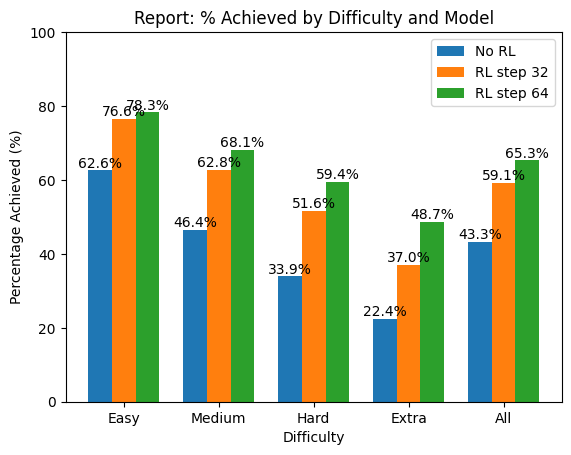
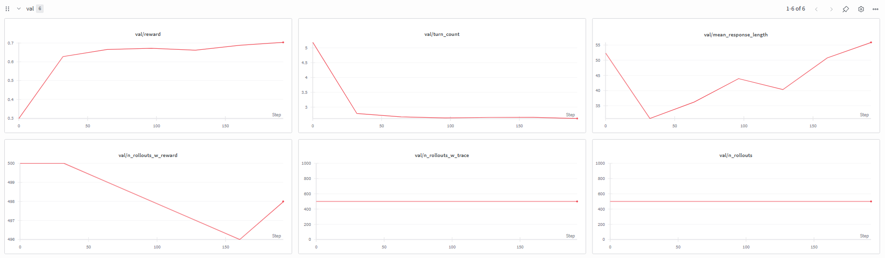
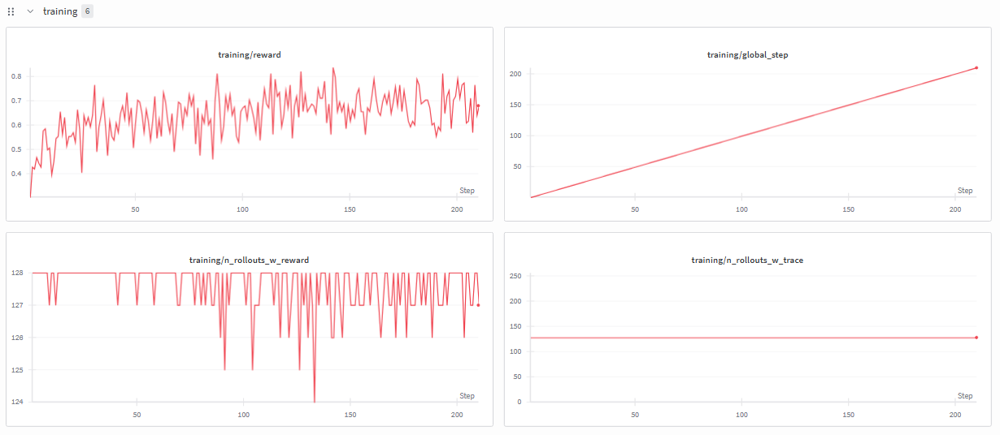
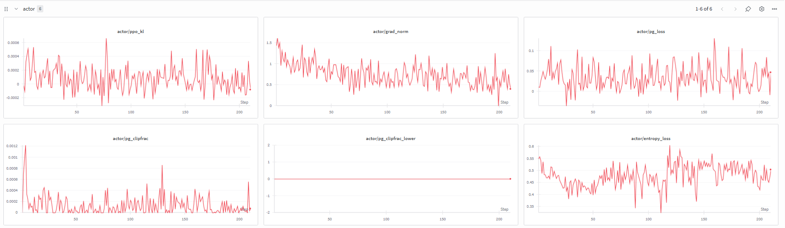

# SQL Agent RL Evaluation Report

Evaluation report of Text-to-SQL Agent that was trained with Reinforcement Learning using Agent Lightning and VERL. 

## Evaluation Report

| Model | Customization | Easy (470) | Medium (857) | Hard (463) | Extra (357) | All (2147) |
|---|---|---|---|---|---|---|
| Qwen2.5-Coder-1.5B-Instruct | None | 62.6% | 46.4% | 33.9% | 22.4% | **43.3%** |
| Qwen2.5-Coder-1.5B-Instruct | RL checkpoint at step 32 | 76.6% | 62.8% | 51.6% | 37.0% | **59.1%** |
| Qwen2.5-Coder-1.5B-Instruct | RL checkpoint at step 192  | 78.3% | 68.1% | 59.4% | 48.7% | **65.3%** |

### Key Findings

- Reinforcement learning on Qwen2.5-Coder-1.5B-Instruct with Agent Lightning improved overall execution accuracy from **43.3% → 65.3%** (+22 percentage points).
- The biggest gains are on harder queries — the "extra hard" category more than doubled from 22.4% to 48.7%.
- Longer training (step 192 vs step 32) continues to improve results, especially on hard/extra categories.

### Prediction Insights

Comparing individual SQL predictions between the base model and the finetuned model (step 192) against gold-standard queries reveals several qualitative improvements:

1. **6× reduction in failed SQL generation.** The base model produced 329 malformed outputs prefixed with `REWRITTEN QUERY` (15.3% of 2,148 predictions) — 158 of which contained no SQL at all. The finetuned model reduced total failures to 52 (`ERROR AGENT INVOCATION`), just 2.4% of predictions.

2. **5× improvement in INTERSECT usage.** Gold queries use `INTERSECT` 84 times. The base model only produced it 13 times (15%), while the finetuned model used it 65 times (77%). This is a key SQL construct for "hard" and "extra hard" queries, explaining much of the accuracy gain on those categories.

3. **Doubled prediction consistency across paraphrases.** Spider duplicates each question with different natural-language phrasing. The finetuned model produces identical SQL for both phrasings 10.2% of the time vs the base model's 4.9% (exact-match), indicating more robust language-to-SQL mapping.

4. **Fewer hallucinated column and table names.** The base model frequently generates nonexistent schema elements — e.g., `Events_number` instead of `Wins_count`, bare `price` instead of `product_price`, `customer_gender_code` on wrong tables, and CamelCase names like `TotalAmount`. The finetuned model aligns much more closely with actual schema names.

5. **More accurate multi-table JOIN paths.** The base model often uses incorrect foreign-key relationships (e.g., `Customers.customer_id = Order_Items.order_id`). The finetuned model more reliably follows correct join chains (e.g., Customers → Orders → Order_Items → Products).

6. **Cleaner SQL output format.** The base model intermixes `REWRITTEN QUERY` prefixes, inconsistent semicolons, aliasing artifacts, and logically impossible predicates (e.g., `Earnings > 1400000 AND Earnings < 1100000`). The finetuned model outputs syntactically valid, consistently formatted SQL.

## Evaluation Setup

These results measure **SQL execution accuracy** — the fraction of predicted SQL queries that produce the same result set as the gold (correct) SQL query when executed against the actual database.

### Difficulty Levels

| Difficulty | Number of Questions | Description |
|---|---|---|
| **Easy** | 470 | ≤1 component (WHERE/GROUP BY/ORDER BY/JOIN), no aggregations, no subqueries |
| **Medium** | 857 | A few components (e.g., 1–2 clauses) |
| **Hard** | 463 | Multiple components or 1 subquery |
| **Extra** | 357 | Many components and/or multiple subqueries |
| **All** | 2,147 | Weighted average across all test questions |

## Training Report

### Training Setup

- **Model:** Qwen2.5-Coder-1.5B-Instruct
- **Algorithm:** GRPO (Group Relative Policy Optimization), no KL penalty (`use_kl_loss: False`)
- **Training samples:** 7,000 | **Validation samples:** 500
- **Batch size:** 32 | **Rollouts per sample (n):** 4 → 128 rollouts per step
- **Learning rate:** 1e-6
- **PPO clip range:** [0.2, 0.3] (`clip_ratio_low` / `clip_ratio_high`)
- **Max prompt / response length:** 4,096 / 2,048 tokens
- **Total epochs:** 2 | **Total training steps:** 210
- **Training duration:** 4h 30m (1× H100 GPU)
- **Validation frequency (`test_freq`):** every 32 steps, with validation before training (`val_before_train: True`)
- **Checkpoint frequency (`save_freq`):** every 32 steps
- **Checkpoints evaluated:**
  - Step 32 (~1h mark)
  - Step 192 (~4h mark)

### Training Metrics

#### Val Metrics

**val/reward** — Mean execution-match reward on the held-out validation set.

- Jumps sharply from ~0.3 to ~0.65 in the first ~30 steps, then continues climbing to ~0.7 by step 192, confirming genuine generalization gains (not just train-set memorization).
- After step 50 the curve largely flattens but never declines, suggesting the policy is improving without overfitting — and that additional training may still yield gains.

**val/turn_count** — Average number of agent turns (write → check → rewrite cycles) per validation rollout.

- Drops steeply from ~5 (the `max_turns` cap) down to ~3 in the first 30 steps, meaning the agent learns to produce correct SQL on earlier attempts and needs fewer repair loops.
- It then stays near 3 for the remainder of training, pointing to a converged, efficient query-generation strategy.

**val/mean_response_length** — Mean token count per model response across validation rollouts.

- Initially drops from ~50 to ~33, reflecting the agent learning to cut verbose or malformed output (e.g., eliminating `REWRITTEN QUERY` prefixes).
- By step 192 it climbs back to ~55, which fits the model producing more complete SQL (e.g., correct `INTERSECT` / multi-table JOINs) as it starts succeeding on harder queries.

**val/n_rollouts_w_reward** — Number of validation rollouts that returned a valid reward (i.e., the SQL was parseable enough to be execution-matched).

- Holds steady at ~500 (out of 500 total) for most of the run, confirming that nearly every rollout produces evaluable SQL.
- The small dip to ~496 toward the end is negligible (<1%) and most likely reflects occasional edge-case DB or parsing failures — not a concern.

**val/n_rollouts_w_trace** — Number of validation rollouts that produced trace/triplet data (agent actually ran turns).

- Flat at ~500 throughout training — every validation task successfully produced traces, indicating no infrastructure issues (timeouts, crashes, etc.).
- Keeping this constant and equal to `val/n_rollouts` is the healthy baseline; any drop would be an operational red flag.

**val/n_rollouts** — Total number of validation rollouts dispatched.

- Constant at ~500 across all checkpoints, confirming the validation set size is fixed and every eval step exercises the full dataset.
- This is essentially a plumbing sanity-check — the important thing is that it never deviates.

#### Train Metrics

**training/reward** — Mean execution-match reward over each training batch.

- Rises from ~0.35 to a noisy band around 0.6–0.8 over 200 steps, with high per-batch variance typical of RL (each batch samples different difficulty levels).
- The downward excursions around steps 100–120 and 180–200 look like normal stochastic RL dips rather than collapse, especially since `val/reward` keeps rising through these periods.

**training/global_step** — Cumulative PPO update count.

- Linear ramp from 0 to ~200, confirming the trainer ran without stalls, restarts, or skipped steps.
- This is mainly a progress counter; the straight-line increase shows the training loop stayed healthy throughout.

**training/n_rollouts_w_reward** — Number of training rollouts per batch that returned a valid reward.

- Stays near 128 (the full batch of `train_batch_size=32 × n=4`) for most of the run, meaning nearly all rollouts produce scorable SQL.
- The periodic drops to ~124–125 around steps 100–140 mean a small fraction of rollouts didn’t return a reward (often agent crashes or unparseable output on difficult samples); these are filled with the default reward of 0.0.

**training/n_rollouts_w_trace** — Number of training rollouts per batch that produced trace data.

- Constant at ~128 after the first step, confirming every training rollout was successfully traced and tokenizable.
- The first step’s brief ramp-up (starting from 0) is expected during initialization.

#### Actor Metrics

**actor/ppo_kl** — KL divergence between the updated policy and the reference policy.

- Stays extremely small (±0.0004), oscillating around zero, which is expected given `use_kl_loss: False` and `kl_loss_coef: 0.0` in your config — there's no KL penalty pulling the policy back.
- Crucially, there’s no sustained upward trend, so the policy isn’t diverging dangerously from the reference despite the lack of an explicit KL constraint.

**actor/grad_norm** — L2 norm of the actor's gradients at each update step.

- Starts around 1.0–1.5 and gradually settles to ~0.5–0.8 over 200 steps, indicating the model is moving from large early updates toward finer refinements.
- The lack of spikes or explosions supports training stability, and the gentle decline is consistent with the run approaching convergence.

**actor/pg_loss** — Policy gradient (surrogate) loss from the PPO objective.

- Fluctuates between 0.0 and 0.1 with no clear upward or downward trend, which is normal — the absolute value isn't directly interpretable as "better" or "worse."
- The key signal is that it never blows up or goes NaN, which indicates the clipping mechanism is keeping updates well-behaved.

**actor/pg_clipfrac** — Fraction of samples where the PPO probability ratio was clipped (upper bound).

- Very low throughout (0.0–0.0012), meaning the policy rarely makes updates large enough to hit the `clip_ratio_high: 0.3` ceiling.
- The early spike (~0.0012 at step 1) is the expected first-update bump; it quickly settles, matching the run’s conservative, stable learning thereafter.

**actor/pg_clipfrac_lower** — Fraction of samples clipped at the lower bound (`clip_ratio_low: 0.2`).

- Flat at 0 for the entire run, meaning the policy never tries to drastically reduce probability on actions it previously favored.
- This aligns with the expected GRPO behavior at a well-matched learning rate — the policy refines rather than reverses its behavior.

**actor/entropy_loss** — Entropy of the policy's output distribution (measures exploration vs. determinism).

- Starts around 0.50–0.55 and gradually drifts down to ~0.40 by step 200, reflecting the policy becoming more confident/deterministic in its SQL generation.
- Because the decline is gentle and doesn’t collapse to near-zero, the model retains enough diversity to handle varied query types without mode collapse.
